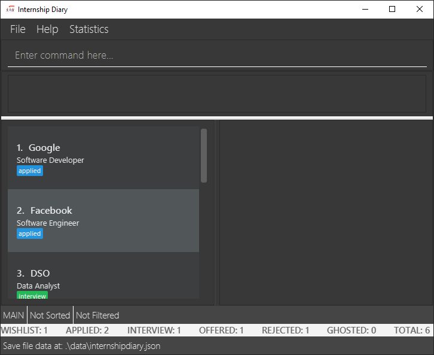

= Internship Diary
ifdef::env-github,env-browser[:relfileprefix: docs/]

https://travis-ci.com/AY1920S2-CS2103T-F10-2/main[image:https://travis-ci.com/AY1920S2-CS2103T-F10-2/main.svg?branch=master[Build Status]]
// https://ci.appveyor.com/project/damithc/addressbook-level3[image:https://ci.appveyor.com/api/projects/status/3boko2x2vr5cc3w2?svg=true[Build status]]
https://coveralls.io/github/AY1920S2-CS2103T-F10-2/main?branch=master[image:https://coveralls.io/repos/github/AY1920S2-CS2103T-F10-2/main/badge.svg?branch=master[Coverage Status]]
image:https://api.codacy.com/project/badge/Grade/70331172a39b4f2293247b771b2928cc["Codacy code quality", link="https://www.codacy.com/gh/AY1920S2-CS2103T-F10-2/main?utm_source=github.com&utm_medium=referral&utm_content=AY1920S2-CS2103T-F10-2/main&utm_campaign=Badge_Grade"]

ifdef::env-github[]

endif::[]

ifndef::env-github[]
image::images/Ui.png[width="600"]
endif::[]

Have you ever sent out an internship application only to find out that you have already applied to that company already?
Have you ever wondered which stage of an internship application you should put more effort into?
As you send internship applications to many different sites and companies, it may be hard or troublesome to keep track of all your applications.
We want to make it easier for you -- by helping you to track your internship applications.

Internship Diary is a desktop internship application tracker that simplifies the process of tracking your internship applications, so that you can focus
on landing your dream internship. If you are a computer science student who loves dabbling with a Command Line Interface (CLI), then this application is for you.

Sounds interesting? Head over to our User Guide to get started!

Internship Diary is an open source project and we welcome any contributions from the community. If you are interested in contributing, feel free to head over to our Developer Guide to find out more!

== Site Map

* <<UserGuide#, User Guide>>
* <<DeveloperGuide#, Developer Guide>>
* <<AboutUs#, About Us>>
* <<ContactUs#, Contact Us>>

== Acknowledgements

* The application is based on Address Book Level 3 from SE-EDU initiative at https://se-education.org .

== Licence : link:LICENSE[MIT]
